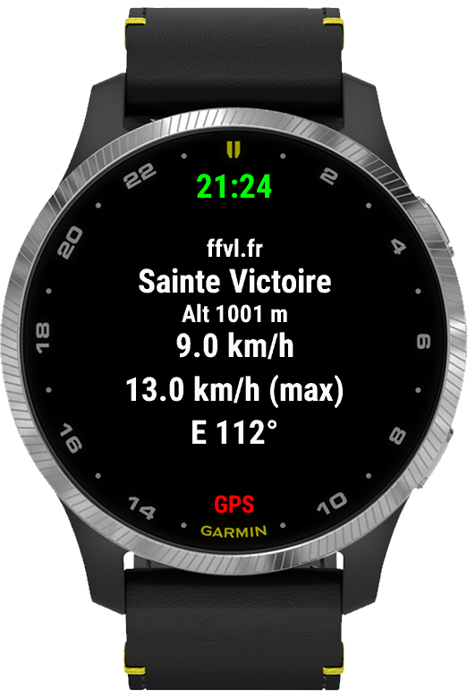

# winds.mobi — Garmin client

A Connect IQ **widget** that shows **real‑time wind observations** from
[winds.mobi](https://winds.mobi) weather stations directly on your Garmin
watch or Edge cycling computer.

Built for paragliders, hang‑glider and speed‑riding pilots, kitesurfers,
windsurfers, sailors and anyone who needs a quick, glanceable read on the wind
before heading out.



---

## Table of contents

- [Features](#features)
- [The four pages](#the-four-pages)
- [Navigation](#navigation)
- [Data source](#data-source)
- [Configuration](#configuration)
- [Installation](#installation)
- [Building from source](#building-from-source)
- [Project structure](#project-structure)
- [How it works](#how-it-works)
- [Localization](#localization)
- [Roadmap](#roadmap)
- [Contributing](#contributing)
- [License](#license)
- [Credits](#credits)

---

## Features

- **Live wind readings** — average wind, gusts and direction, refreshed from
  the winds.mobi API.
- **Up to 8 favorite stations**, selectable from an on‑device menu.
- **Nearest stations by GPS** — optionally discover and add the closest
  stations around your position.
- **Four data views per station**: current data, 1‑hour history chart,
  compass, and 1‑hour statistics.
- **Gust factor** (peak ÷ mean wind), color‑coded by turbulence — a
  direction‑independent hint on how rough the air is.
- **Data freshness indicator** — the timestamp is colored green / orange / red
  depending on how recent the last measurement is.
- **Glance view** — see your main station in the widget carousel without
  opening the app.
- **Background refresh** — the main station is updated every 5 minutes so the
  glance stays current.
- **Units** — metric + km/h or imperial + knots.
- **Available in English and French** (German falls back to English).

## The four pages

Each selected station has four pages you can page through:

| Page | Shows |
|------|-------|
| **Data** | Provider, altitude, station name, gust factor, an Avg / Max / Δ(1h) table, wind direction (cardinal + degrees) and the last‑measurement time. |
| **History** | A line chart of average wind and gusts over the last hour, with a scaled vertical axis. |
| **Compass** | A wind rose with an arrow pointing to where the wind comes **from**, plus the current avg / max in the center. |
| **Stats** | Min / average / max wind and strongest gust over the last hour, plus the average gust factor. |

**Gust factor legend** (turbulence): 🟢 `< 1.3` smooth · 🟠 `1.3–1.7` active ·
🔴 `≥ 1.7` turbulent.

## Navigation

The widget uses two independent axes:

- **Up / Down** (buttons) or **swipe up / down** (touch) → move between the
  four **pages** of the current station.
- **START / Select** (button) or **tap** (touch) → open the **station picker**
  to choose another station.

On button watches, a small native arc is drawn next to the **START** button as
a hint that it opens the station list.

## Data source

All data comes from the public [winds.mobi API v2](https://winds.mobi/api/2).
The widget calls:

| Endpoint | Purpose |
|----------|---------|
| `GET /stations/{id}` | Latest observation for a station |
| `GET /stations/{id}/historic/?duration=3600` | Last hour of measurements (history + stats + trend) |
| `GET /stations/?near-lat=&near-lon=&near-distance=` | Nearest stations around a GPS position |

A **station id** is `provider-id`, e.g. `holfuy-1307`, `ffvl-134`,
`meteoswiss-ATT`, `windline-4108`, `slf-ILI1`. You can find station ids by
browsing the map on [winds.mobi](https://winds.mobi) and looking at the station
URL.

> An internet connection is required: the watch fetches data through your
> phone's Bluetooth connection (or Wi‑Fi/LTE on capable devices). Without a
> phone connection the widget shows a "no phone" screen.

## Configuration

Settings are edited from the **Garmin Connect** mobile app (or **Garmin
Express** on desktop): *Connect IQ → winds.mobi → Settings*.

| Setting | Type | Default | Description |
|---------|------|---------|-------------|
| `Station 1` … `Station 8` | text | a few example ids | Station ids to display. `Station 1` is the one shown in the glance and refreshed in the background. Leave blank to skip. |
| `Measurement Units` | list | Km/h + Metric | `Km/h + Metric` or `Kts + Imperial`. |
| `Display nearest stations (GPS)` | boolean | on | Fetch and add the closest stations to your position. |
| `Distance (km)` | number | 10 | Search radius for nearest stations. |

## Installation

### From a release (manual sideload)

1. Download the `.prg` for your device from the
   [Releases](https://github.com/winds-mobi/winds-mobi-client-garmin/releases)
   page.
2. Connect your Garmin to your computer with a USB cable; it mounts as a drive.
3. Rename the file to `winds.mobi.prg` and copy it to `GARMIN/APPS/` on the
   device.
4. Safely eject the drive (don't just unplug) and find the widget in your
   device's Connect IQ / widget list.

If your device isn't in the releases, build it yourself (below) or open an
issue.

### From the Connect IQ Store

If published, install it from the Connect IQ Store via the Garmin Connect app
(search for "winds.mobi").

## Building from source

### Prerequisites

- [Connect IQ SDK](https://developer.garmin.com/connect-iq/sdk/) (SDK **7.x+**;
  developed against **9.2.0**).
- A **JDK 17+** on your `PATH` (the SDK's compiler is a Java tool).
- [Visual Studio Code](https://code.visualstudio.com/) with the official
  **Monkey C** extension, **or** the SDK command‑line tools.
- A **developer key** (`Monkey C: Generate a Developer Key` in VS Code, or via
  `openssl`). It is used to sign the app and is **never** committed
  (see `.gitignore`).

> **Minimum API level is 3.0.0** (required by the `Menu2` station picker), so
> the app targets Connect IQ 3.0+ devices.

### Build & run in VS Code

1. Open the project folder.
2. `Ctrl/Cmd+Shift+P → Monkey C: Build Current Project` to produce a `.prg`, or
   press **F5** (*Run App*) to build and launch the simulator.
3. Pick a target device when prompted (e.g. `fenix7`, `fr945`, `epix2pro51mm`).

### Build from the command line

```sh
monkeyc \
  -o bin/winds.mobi.prg \
  -f monkey.jungle \
  -y /path/to/developer_key \
  -d fenix7 \
  -w
```

To run it in the simulator:

```sh
connectiq                       # start the simulator
monkeydo bin/winds.mobi.prg fenix7
```

> In the simulator, enable a simulated phone/network connection
> (*Settings → …*) so the winds.mobi requests succeed.

## Project structure

```
manifest.xml            App metadata, permissions, supported devices, languages
monkey.jungle           Build configuration
resources/              Default (English) strings, properties/settings, layouts, drawables
resources-fre/          French strings
source/
  windsApp.mc           App entry point; wires the initial view and background service
  WindsController.mc    Shared state: station list, data fetch, navigation, Menu2 picker
  DataView.mc           Page 0 — current observation + gust factor + freshness
  HistoryView.mc        Page 1 — 1‑hour wind/gust chart
  CompassView.mc        Page 2 — wind‑direction compass
  StatsView.mc          Page 3 — 1‑hour min/max/avg/gust + gust factor
  WidgetGlanceView.mc   Glance (carousel) view
  WindsSpeedDelegate.mc Background service refreshing the main station
  notconnectedView.mc   "No phone connection" screen
  Utils.mc              API endpoint, unit conversions, orientation, gust factor
```

## How it works

- On launch, `WindsController` reads the configured station ids (and, if GPS is
  enabled, requests the nearest stations), then fetches the current + historic
  data for the selected station **once** and shares it across all four pages —
  no re‑download when you switch pages.
- Wind **direction** follows the meteorological convention (the direction the
  wind blows **from**).
- The **freshness** color reflects both the winds.mobi station status and the
  age of the last sample (green ≤ 1 h, orange 1–2 h, red older / offline).
- A **background service** refreshes `Station 1` every 5 minutes and caches the
  result so the **glance view** stays up to date without opening the widget.

Requested device permissions: **Communications** (HTTP), **Positioning** (GPS
for nearest stations) and **Background** (periodic refresh).

## Localization

The UI ships with **English** and **French** string resources. German is
declared but currently falls back to English. Cardinal directions and settings
labels are localized; contributions for more languages are welcome.

## Roadmap

- Rename / manage favorite stations from the menu.
- Orient the compass on the take‑off direction (front / cross / tail wind).
- Optional touch hint for touchscreen devices.

## Contributing

Issues and pull requests are welcome. Please:

- Keep changes focused and match the existing code style.
- Test in the simulator on at least one round and one rectangular device.
- Never commit signing keys or build output (both are git‑ignored).

## License

Distributed under the **GNU Affero General Public License v3.0** (AGPL‑3.0).
See [LICENSE](LICENSE).

## Credits

- Weather data by the open‑source [winds.mobi](https://winds.mobi) project.
- Built with the Garmin [Connect IQ](https://developer.garmin.com/connect-iq/)
  SDK and Monkey C.
